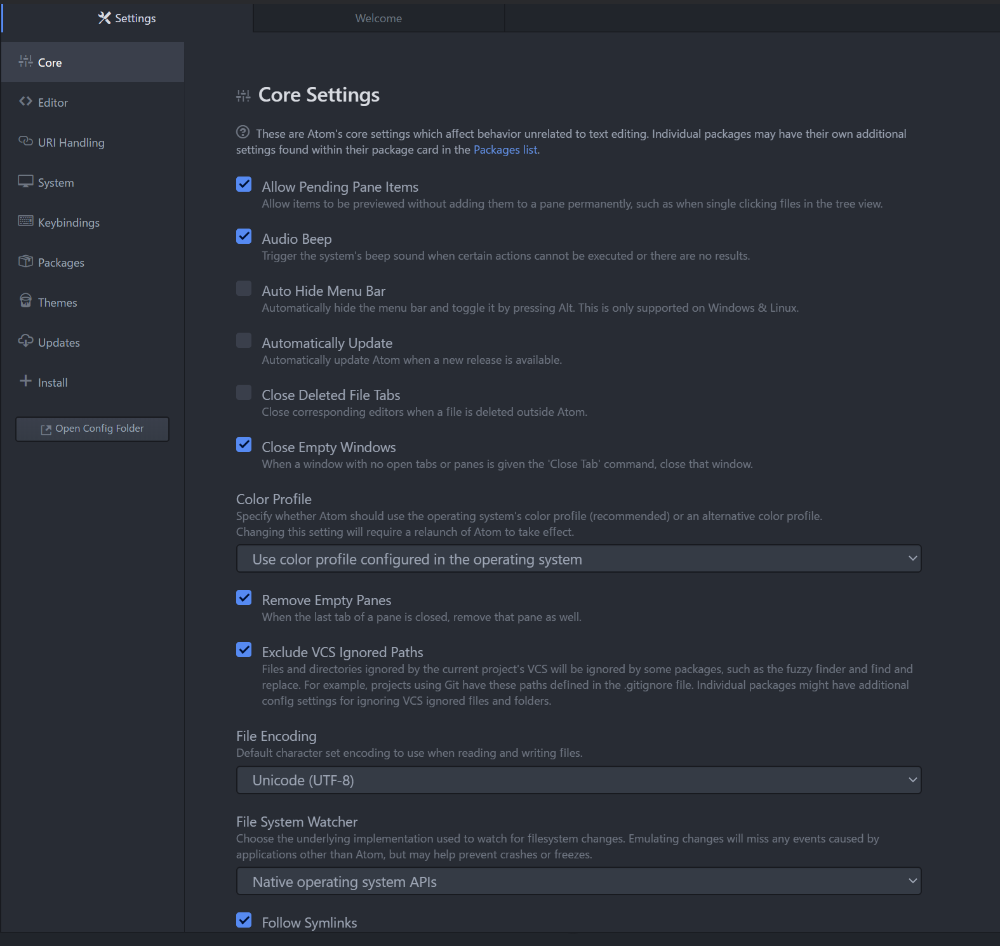

# Atom Component for atom-i18n to localize

## 1. Atom parts to be localized

| No  | Parts                | description                                      |
|----:|:---------------------|:-------------------------------------------------|
|   1 | Menu                 | You can select the item to execute the functions from Menu-bar, which is displayed at the top of the window. |
|   2 | Context Menu         | You can select the item to execute the functions from pop-up menu, by mouse right click. |
|   3 | Settings             | You can change and set the 'Atom' configuration.   |
|   4 | About                | You can update 'Atom' version in 'About Atom' view.   |
|   5 | Welcome              | Initially launch Atom show 'Welcome',  'Welcome Guide' and 'Telemetry Consent' view. |
|   6 | Find panel           | You can search with 'Find and Replace' and 'Find in Project' panel. |
|   7 | Keybind dock         | You can see the keybinding in 'Keybinding Resolver'. |
|   8 | Git/GitHub tab       | You can connect Git and GitHub in 'Git/GitHub' tab.  |
|   9 | Tree View            | 'Atom' show the file and directory list at the left panel |
|  10 | Notification         | 'Atom' show the dialog as 'Notification' at upper-right corner in the Atom window. |

## 1. Menu

| type          | file path                                                |
|:--------------|:---------------------------------------------------------|
| atom/         | [menus](https://github.com/atom/atom/tree/master/menus)  |
| atom-i18n/lib | menu.js                                                  |
| atom-i18n/def | menu_{darwin, linux, win32}.cson                         |

## 2. Context Menu

| type          | file path                                                                       |
|:--------------|:--------------------------------------------------------------------------------|
| atom/         | [Atom Core Packages](https://github.com/atom/atom/tree/master/packages)/menus/  |
| atom-i18n/lib | contextMenu.js                                           |
| atom-i18n/def | context.cson                         |

## 3-a. Settings -> Core

| type          | file path                                                                       |
|:--------------|:--------------------------------------------------------------------------------|
| atom/         | [Atom Core Packages](https://github.com/atom/atom/tree/master/packages)/menus/  |
| atom-i18n/lib | preference/{index, settings, utils}.js                                          |
| atom-i18n/def | settings.cson                                                                   |

### 3-b. Settings -> Editor

### 3-c. Settings -> URI 

### 3-d. Settings -> System 

### 3-e. Settings -> Keybindings 

### 3-f. Settings -> Packages

### 3-g. Settings -> Themes

### 3-h. Settings -> Updates

### 3-i. Settings -> Install

## 4. About Atom

| type          | file path                                                                       |
|:--------------|:--------------------------------------------------------------------------------|
| atom/         | [packages/about/](https://github.com/atom/atom/tree/master/packages/about)      |
| atom-i18n/lib | about.js                                                                        |
| atom-i18n/def | about.cson                                                                      |

## 5-a. Welcome

| type          | file path                                                                       |
|:--------------|:--------------------------------------------------------------------------------|
| atom/         | [packages/welcome/](https://github.com/atom/atom/tree/master/packages/welcome)  |
| atom-i18n/lib | welcome.js                                                                      |
| atom-i18n/def | welcome.cson                                                                    |

### 5-b. Welcome Guide

| type          | file path                                                                       |
|:--------------|:--------------------------------------------------------------------------------|
| atom/         | [packages/welcome/](https://github.com/atom/atom/tree/master/packages/welcome)  |
| atom-i18n/lib | guide.js                                                                        |
| atom-i18n/def | guide.cson                                                                      |

### 5-c. Telemetry Consent

| type          | file path                                                                       |
|:--------------|:--------------------------------------------------------------------------------|
| atom/         | [packages/welcome/](https://github.com/atom/atom/tree/master/packages/welcome)  |
| atom-i18n/lib | consent.js                                                                      |
| atom-i18n/def | consent.cson                                                                    |

## 6-a. Find and Replace

| type          | file path                                                                       |
|:--------------|:--------------------------------------------------------------------------------|
| atom/         | [atom/find-and-replace](https://github.com/atom/find-and-replace)               |
| atom-i18n/lib | find.js                                                                         |
| atom-i18n/def | find.cson                                                                       |

### 6-b. Find in Project

| type          | file path                                                                       |
|:--------------|:--------------------------------------------------------------------------------|
| atom/         | [atom/find-and-replace](https://github.com/atom/find-and-replace)               |
| atom-i18n/lib | findProject.js                                                                  |
| atom-i18n/def | project.cson                                                                    |

## 7. Keybinding Resolver

| type          | file path                                                                       |
|:--------------|:--------------------------------------------------------------------------------|
| atom/         | [atom/keybinding-resolver](https://github.com/atom/keybinding-resolver)         |
| atom-i18n/lib | keybind.js                                                                      |
| atom-i18n/def | keybind.cson                                                                    |

## 8-a. Git tab

| type          | file path                                                                       |
|:--------------|:--------------------------------------------------------------------------------|
| atom/         | [atom/github](https://github.com/atom/github)                                   |
| atom-i18n/lib | github.js                                                                       |
| atom-i18n/def | github.cson                                                                     |

### 8-b. GitHub tab

## 9. Tree View

| type          | file path                                                                       |
|:--------------|:--------------------------------------------------------------------------------|
| atom/         | [atom/tree-view](https://github.com/atom/tree-view)                             |
| atom-i18n/lib | treeview.js                                                                         |
| atom-i18n/def | treeview.cson                                                                       |

## 10. Notification

| type          | file path                                                                       |
|:--------------|:--------------------------------------------------------------------------------|
| atom/         | [atom/find-and-replace](https://github.com/atom/find-and-replace)               |
| atom-i18n/lib | notification.js                                                                 |
| atom-i18n/def | notification.cson                                                               |
